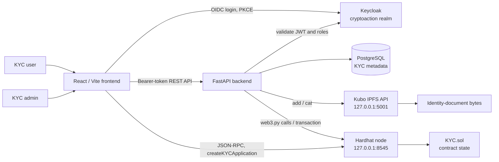
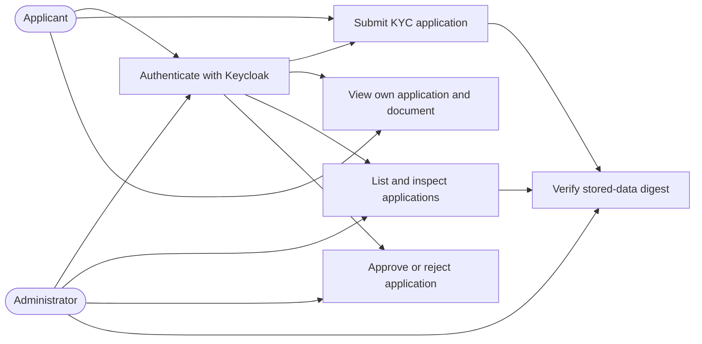
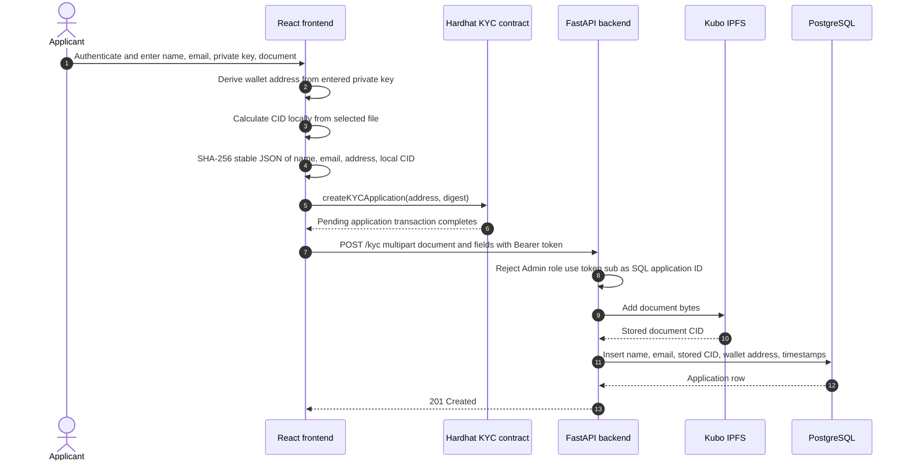
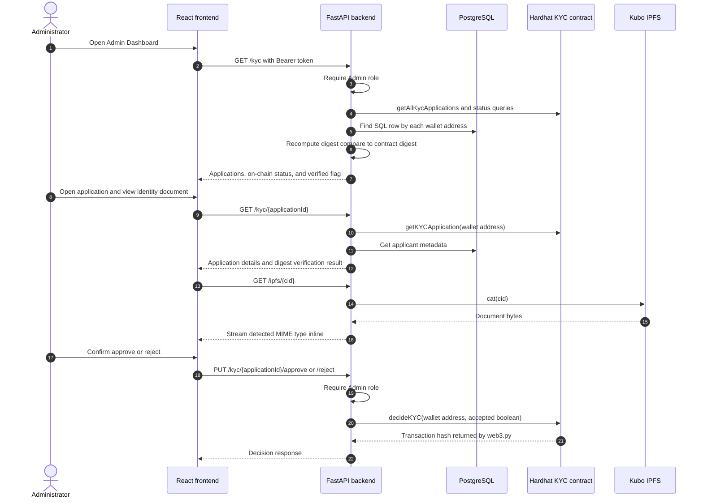
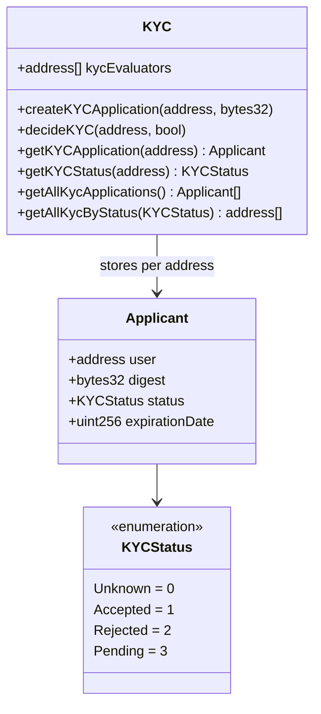
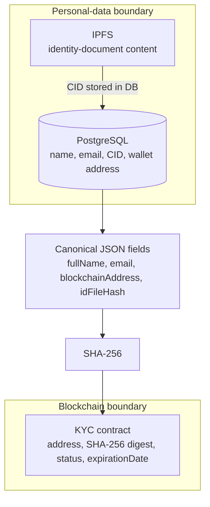

# CryptoAction Architecture

## Scope and Source of Truth

CryptoAction is a KYC application with a React single-page application, a FastAPI backend, PostgreSQL, IPFS, Keycloak, and a Solidity KYC contract. The currently configured blockchain is a local Hardhat JSON-RPC node at `http://127.0.0.1:8545`. The Besu network in `besu-test-network/` is separate from this KYC runtime configuration.

The application has two complementary records for an application:

| Concern | Current source of truth |
| --- | --- |
| Applicant name, email, document CID, application UUID, and timestamps | PostgreSQL |
| Document bytes | IPFS via the Kubo node |
| Applicant wallet address, integrity digest, and KYC status | KYC smart contract |
| User identity and `User` / `Admin` roles | Keycloak access token |

The backend joins the SQL record to the contract record by `blockchainAddress`. It returns a `verified` flag after recomputing a SHA-256 digest from the database fields and comparing it with the contract digest. It returns status from the contract, not from a database status column.

## Runtime Components

`compose.yml` starts Keycloak, PostgreSQL, and IPFS. The backend is started separately and initialises SQL tables, a web3 contract binding, and the IPFS client in its FastAPI lifespan. The frontend has fixed development endpoints for those services and the deployed local contract address.

## Actors and Use Cases

The landing page uses Keycloak resource roles to show the User or Admin path. The route guard requires an authenticated session. The backend is the enforcement point: users may create an application and read their own application; admins can list, obtain statistics, read any application, and decide an application. An admin is explicitly blocked from `POST /kyc`.

## User Applies for KYC

The contract transaction is performed before the REST submission. `createKYCApplication` records the wallet address, supplied digest, `Pending` status, and a zero `expirationDate`; it does not receive document bytes or personal data. The contract does not require `msg.sender == user`, so this function accepts an arbitrary `user` address from any transaction sender, subject only to the one-application-per-address check.

The browser computes a document CID for the digest, but it does not send that CID to the backend. The backend independently adds the uploaded bytes to IPFS and stores the returned CID. Integrity verification therefore depends on both implementations producing the same CID for the same file. This is an implementation dependency, not an enforced protocol guarantee; a CID mismatch makes the API report `verified: false`.

## Admin Evaluates KYC

The backend changes the contract status through `decideKYC`; the contract permits only addresses supplied as `kycEvaluators` at deployment. The configured local evaluator is Hardhat account 0. The REST admin role and contract evaluator role are separate authorization systems and must refer to a backend transaction sender that is also an evaluator.

## Contract Model

At deployment, `smart-contracts/ignition/modules/KYC.ts` configures Hardhat account 0 as the sole evaluator. The local deployment address in the frontend and backend defaults is `0x5fbdb2315678afecb367f032d93f642f64180aa3`. The contract emits `KYCStatusChanged` for each decision. It has no event for application creation and no function that updates `expirationDate`; as written that field remains zero.

## Data, Integrity, and Storage Boundaries

The intended integrity relation is:

$$
\mathrm{digest} = \mathrm{SHA256}(\mathrm{canonicalJSON}(\mathrm{fullName}, \mathrm{email}, \mathrm{blockchainAddress}, \mathrm{idFileHash}))
$$

The frontend uses `json-stable-stringify`, a Web Crypto SHA-256 digest, an `0x`-prefixed hex value, and a locally calculated CID. The backend uses sorted, compact `json.dumps`, `hashlib.sha256`, the CID returned by its IPFS upload, and compares the returned hex without a prefix. The key order is compatible because both are sorted, but the protocol has no shared server-issued digest or CID assertion, so both the CID construction and the full field serialization must remain compatible.

IPFS is used as content-addressed storage, not as an access-control system. The backend retrieves a CID from IPFS and streams it under `GET /ipfs/{file_hash}` after detecting its MIME type. This route currently has no authentication or ownership/role check.

## Security Model

### Trust Boundaries and Controls

| Boundary | Current control | Security property |
| --- | --- | --- |
| User or admin to frontend | Keycloak OIDC with PKCE; browser refreshes access tokens | Authenticated browser session |
| Frontend to FastAPI | Bearer token injected by Axios; backend verifies JWT signature, audience, and Keycloak signing algorithm | Backend endpoint authentication |
| REST authorization | Backend reads `resource_access.cryptoaction-backend.roles`; `Admin` is needed for review and decisions | Role-based access control at API boundary |
| Backend to PostgreSQL | Database credentials from environment variables; Docker publishes port only on loopback | Metadata persistence and local network exposure reduction |
| Backend to IPFS | Kubo API is bound to loopback in Compose | Backend is the intended uploader/fetcher |
| Browser/backend to contract | Contract evaluator allowlist protects `decideKYC` and evaluator-only reads | On-chain decision authorization |
| SQL record to contract record | SHA-256 digest comparison and wallet-address join | Tamper-evident comparison when all inputs match |

### Current Security Limitations

These are properties of the present implementation, not claims of protection:

1. The KYC form labels `blockchainAddress` as "Private Key" and passes its value to `privateKeyToAccount`. This exposes a user private key to frontend JavaScript, browser memory, console logging of the account, and the network-origin trust boundary. It is not MetaMask integration.
2. The frontend uses viem's Hardhat test client and a fixed local RPC endpoint. This is a development-only signing model and has no user wallet approval flow.
3. `GET /ipfs/{file_hash}` does not require a token or authorize access to a document. Possession or discovery of a CID is sufficient to request the document through the API. A CID is an identifier, not a confidentiality control.
4. The FastAPI CORS configuration allows every origin while also allowing credentials. Origin restrictions should be explicitly configured for the deployed frontend.
5. Contract read functions require `msg.sender` to be the applicant or an on-chain evaluator. The backend web3 wrapper does not set a `from` address for its restricted calls, and it does not configure an explicit transaction signer for `decideKYC`. A working deployment therefore requires the node to supply an evaluator sender; this dependency is not represented in backend configuration.
6. The REST Admin role does not itself confer on-chain evaluator privileges. Keycloak role assignment and the contract's immutable evaluator array must be administered consistently.
7. The contract's `createKYCApplication` accepts a `user` argument without requiring it to match `msg.sender`. An arbitrary sender can reserve another address with a digest, causing an availability/identity-binding risk.
8. Application creation crosses two independent systems: the chain transaction succeeds before the database/IPFS request. A failure in the second step leaves an on-chain application without a matching SQL/IPFS record; the reverse can occur if the frontend transaction does not complete before the API request is made.
9. Status is contract-derived, but expiration is not. The Solidity `expirationDate` is never written, and the backend approval condition compares an enum to an integer, so the current code does not set the SQL `expiringAt` timestamp on approval.
10. Application listing and statistics rely on contract calls. Contract availability, deployment-address consistency, and the backend caller identity are service dependencies for otherwise database-backed screens.

## Deployment and Operational Notes

The documented startup order is: run the Hardhat node, deploy `KYC.sol` with Ignition, start Compose services, start FastAPI, then start the Vite frontend. The backend and frontend each default to the local Hardhat address, so redeploying creates a coordination requirement to update both configuration values. Smart-contract tests cover pending creation, acceptance, status filtering, and the status-change event; no backend or frontend test suite currently demonstrates the complete KYC workflow.

For a production security design, use a wallet provider rather than collecting private keys, require authenticated and authorized document retrieval, keep a server-side signing key in a managed secret store or use an evaluator wallet service, make on-chain application creation bind `msg.sender` to the applicant, define one canonical CID/digest creation protocol, and record/reconcile transaction receipts across the chain and database boundary.